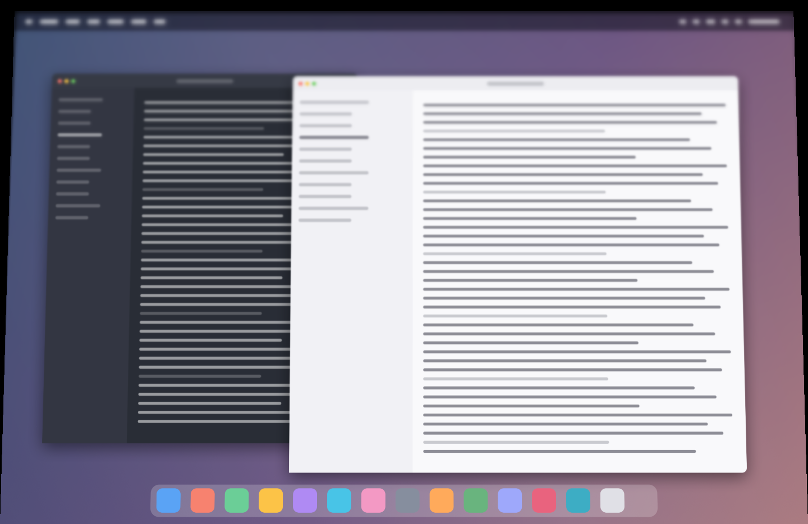
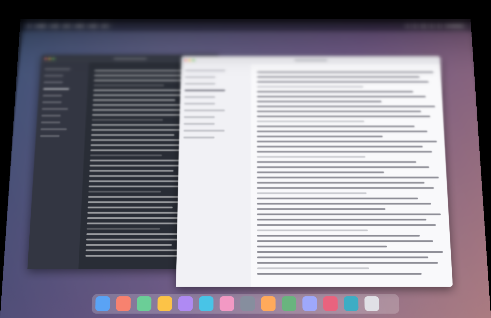
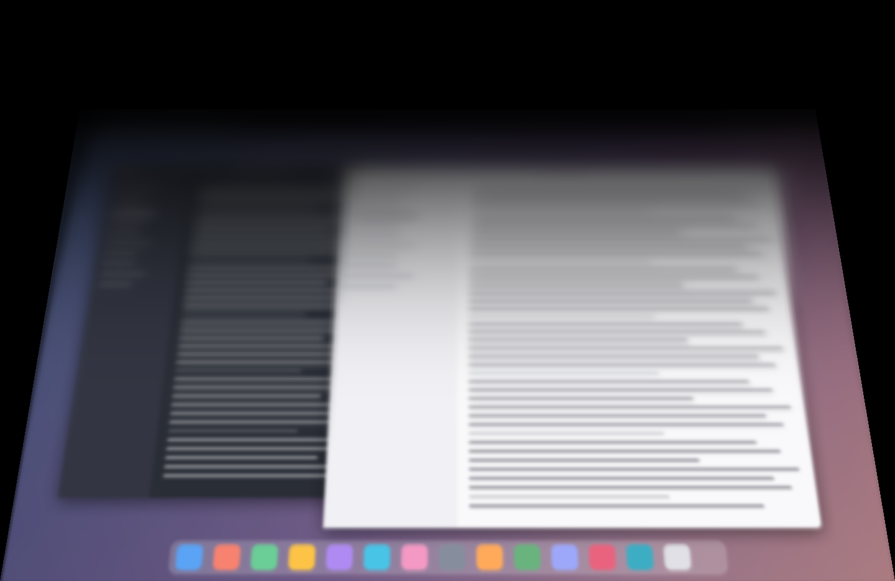
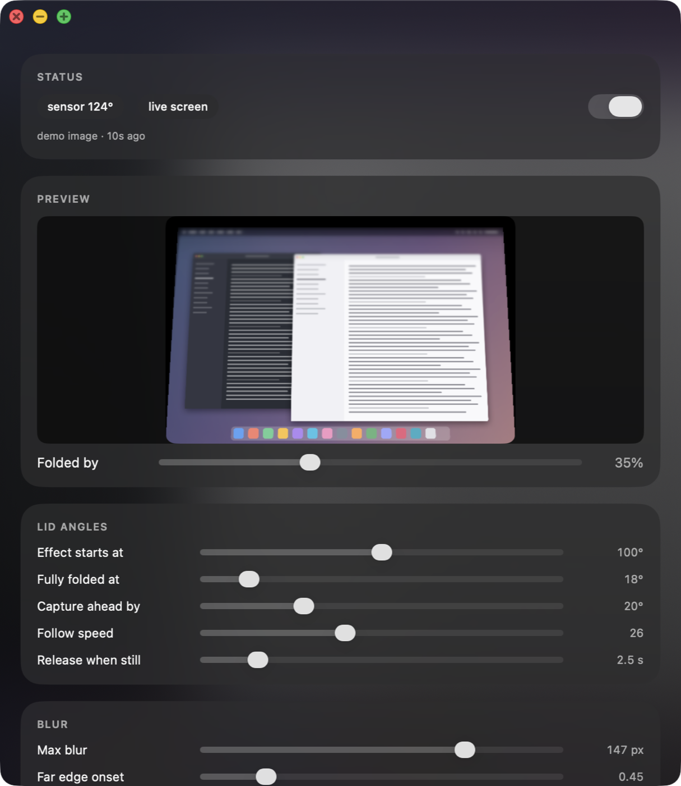

# Duo More Thing — эффект складывания iPhone Duo на MacBook

Закрываешь крышку MacBook — интерфейс складывается вокруг нижнего края экрана:
уходит в перспективу, размывается и растворяется в темноте, сильнее к верхнему
краю, резко у «шарнира». Открываешь — разворачивается обратно. Всё привязано
к реальному физическому углу крышки из встроенного датчика.

| 20% | 40% | 80% |
|---|---|---|
|  |  |  |



## Сборка и запуск

```bash
./build.sh              # собрать в build/Duo More Thing.app
./build.sh install      # собрать и положить в /Applications
```

Нужны Xcode Command Line Tools и macOS 26. Metal-тулчейн НЕ нужен — шейдер
компилируется в рантайме из `Contents/Resources/Fold.metal`, его можно править
прямо в бандле и просто перезапускать приложение.

Приложение живёт в меню-баре и показывает текущий угол крышки.

### Разрешение на запись экрана — обязательно

**Запускать `Duo More Thing.app` надо из Finder или Spotlight.** Если запустить его из
терминала или из другого приложения, macOS припишет запрос разрешения
родительскому процессу, и Duo More Thing в списке так и не появится.

При первом запуске система спросит разрешение сама. Если промахнулся — открой
панель настроек (меню-бар → «Настройка эффекта…») и нажми «Дать разрешение на
запись экрана», либо руками:
System Settings → Privacy & Security → Screen & System Audio Recording → Duo More Thing.

Без разрешения приложение показывает **обои рабочего стола вместо интерфейса** —
эффект работает, но выглядит так, будто интерфейс просто исчез. В панели
настроек состояние источника видно всегда: зелёная плашка «живой экран» или
оранжевая «обои».

## Панель настроек

Liquid Glass, живое превью эффекта со слайдером «Сложено на» — можно подбирать
параметры, не трогая крышку.

**Углы крышки** — с какого угла начинается эффект, при каком он полный,
за сколько градусов до начала делается снимок экрана, инерция следования
за датчиком, и через сколько секунд неподвижной *слегка* прикрытой крышки
эффект отпускает экран (страховка, чтобы чуть прикрытой крышкой можно было
пользоваться). Настоящий сгиб (сила ≥ 0.25) сам не пропадает; «never» на
слайдере отключает страховку совсем.

**Размытие** — максимальный радиус, отдельно кривая отклика у верхнего края
(меньше 1 — верх мылится сразу, как только начал закрывать) и кривая у шарнира
(больше 1 — низ дольше держит резкость), форма градиента между ними.

**Складывание в 3D** — наклон панели при полном сложении, кривая нарастания
наклона, сила перспективы, и насколько боковые (и дальний) края панели
растворяются в темноте.

**Тень** — глубина и момент начала затемнения.

**Background** — по умолчанию включено «Room behind the fold»: FaceTime-камера снимает комнату перед ноутбуком, человек убирается на устройстве, дыра заливается окружающим фоном, снимок сильно размывается и рисуется *позади* складывающейся панели. Выключи — снова чёрная пустота. Нужно разрешение Camera; запускать приложение из Finder.

## Ключи запуска (отладка)

```bash
open "build/Duo More Thing.app" --args --settings          # сразу открыть панель
open "build/Duo More Thing.app" --args --preview           # проиграть анимацию через 1.5 с
"./build/Duo More Thing.app/Contents/MacOS/DuoMoreThing" --hold 0.55        # зафиксировать силу эффекта
"./build/Duo More Thing.app/Contents/MacOS/DuoMoreThing" --render-test ./out [картинка.png]   # 6 кадров в PNG
```

## Как это устроено

`Sources/LidAngleSensor.swift`
: Датчик угла крышки. IOKit HID, **feature report** (не input report):
  VendorID `0x05AC`, ProductID `0x8104`, UsagePage `0x20`, Usage `0x8A`,
  reportID 1 → 3 байта `[0x01, lo, hi]`, угол = little-endian `UInt16` в градусах.
  Есть на MacBook Pro 16" 2019 и новее. Проверено на MacBook Pro 14" M2 Pro.

`Sources/ScreenSource.swift`
: Снимок экрана через `SCScreenshotManager`. Снимок делается на «взводе» —
  за `armLead` градусов до начала эффекта, пока оверлей ещё не показан, поэтому
  приложение не снимает само себя. Фолбэк без разрешения — обои.

`Sources/OverlayController.swift`
: Полноэкранное borderless-окно на уровне `CGShieldingWindowLevel` (выше
  меню-бара и Dock), сквозное для мыши. Системный интерфейс публичными API
  не размыть — поэтому поверх него кладётся замороженный кадр.

`Shaders/Fold.metal` + `Sources/FoldRenderer.swift`
: Кадр рисуется как quad, повёрнутый вокруг нижнего края и спроецированный
  перспективой. Проекция подобрана так, что при силе 0 панель совпадает
  с экраном пиксель в пиксель, а дальше уходит вглубь в чёрную пустоту.
  Переменный блюр — гауссова mip-пирамида (`MPSImageGaussianPyramid`) плюс
  сэмплирование с явным LOD: `n = mix(s^hingeCurve, s^topCurve, d^shape)`,
  две независимые кривые для дальнего края и края у шарнира.

`Sources/FoldController.swift`
: Угол → сила → сглаживание → оверлей. Плюс страховка по неподвижной крышке.

`Sources/SettingsPanel.swift`
: SwiftUI + Liquid Glass, живое офскрин-превью эффекта.

## Ограничения

- Эффект рисуется поверх замороженного кадра: пока он идёт, интерфейс не живой.
  Это и есть суть анимации.
- На экране блокировки macOS не даёт рисовать оверлей — анимация разворота после
  сна отработает, только если система не успела залочиться.
- Только встроенный дисплей.
